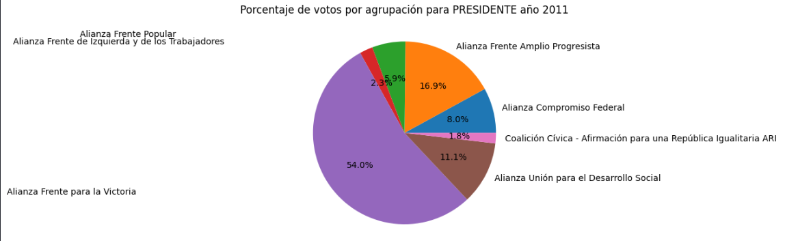

## RESULTADOS PRESIDENCIALES 2011 - 2023
Este proyecto es el primero de una serie que buscan procesar los resultados electorales al Ejecutivo Nacional de Argentina en estos 40 años de democracia.
En una siguiente etapa se buscará relacionar los mismos con indicadores sociales y económicoscomo la inflación, el valor de la canasta familiar y el precio del dólar. 
Se espera poder observar si existen movimientos políticos en las decisiones de la ciudadanía a lo largo de estas 4 décadas.
Los CSV fueron extraídos de la página oficial del gobierno:
https://www.argentina.gob.ar/dine/resultados-electorales

######Aclaración
- Antes de 2011 no hay archivos csv sino xlsx que serán procesados en la siguiente etapa
- Los datos son de los escrutinios provisorios, dando diferencia en los totales con respecto a los definitivos, pero son ínfimas las mismas.

#### Procesamiento de los CSV
Se parametriza la apertura de los archivos, permitiendo que el mismo archivo sirva para todos. De esta forma, tras normalizar los datos, se obtienen gráficos que tienen la misma estructura
~~~
anio_eleccion = "2011"
df = pd.read_csv (anio_eleccion+"/ResultadosElectorales.csv")
~~~
Se eliminan las columnas innecesarias para este proyecto.
Luego se quitan las filas que tienen resultados de otros cargos no ejecutivos. 
~~~
df_limpio = df[['padron_tipo', 'distrito_id', 'distrito_nombre','seccionprovincial_nombre', 'seccion_nombre', 'mesa_tipo','cargo_nombre', 'agrupacion_nombre', 'votos_tipo','votos_cantidad']]

cargos_principales = ['PRESIDENTE', 'JEFE DE GOBIERNO', 'GOBERNADOR']
df_cargos_principales =  df_limpio[df_limpio['cargo_nombre'].isin(cargos_principales)]
~~~

Obtengo los votos positivos presidente por agrupacion
~~~
df_presidente = df_cargos_principales[(df_cargos_principales['cargo_nombre'] == 'PRESIDENTE')].groupby('agrupacion_nombre')['votos_cantidad'].sum()
~~~

Obtengo los resultados presidenciales provincia por provincia
~~~
resultados_pte_prov = []
for distrito in distritos:
    resultado_pte_prov = df_cargos_principales[(df_cargos_principales['cargo_nombre'] == 'PRESIDENTE') & (df_cargos_principales['distrito_nombre'].str.upper() == distrito)].groupby('agrupacion_nombre')['votos_cantidad'].sum().reset_index()
    resultado_pte_prov['distrito_nombre'] = distrito
    resultados_pte_prov.append(resultado_pte_prov)
~~~

Realizo los gráficos para presidente nacional y presidente provincia por provincia
~~~
total_votos_presidente = df_presidente.sum()
# Calcular el porcentaje de votos para cada agrupación
porcentaje_por_agrupacion = (df_presidente / total_votos_presidente) * 100
plt.pie(porcentaje_por_agrupacion, labels=porcentaje_por_agrupacion.index, autopct='%1.1f%%')
plt.title('Porcentaje de votos por agrupación para PRESIDENTE año '+anio_eleccion)
~~~

~~~
colores = ['blue', 'green', 'red', 'purple', 'orange']
ax = porcentaje_por_agrupacion.plot(kind='bar',color=colores)
plt.title('Porcentaje de votos por agrupación para PRESIDENTE año '+anio_eleccion)
plt.xlabel('Agrupación')
plt.ylabel('Porcentaje de Votos')
for p in ax.patches:
    ax.annotate(f'{p.get_height():.2f}%', (p.get_x() + p.get_width() / 2., p.get_height()), ha='center', va='center', xytext=(0, 10), textcoords='offset points')
~~~

~~~
df_resultado_pte_prov = pd.concat(resultados_pte_prov, ignore_index=True)
df_resultado_pte_prov.pivot_table(index='distrito_nombre', columns='agrupacion_nombre', values='votos_cantidad', fill_value=0).plot(kind='bar',stacked=True)
plt.title('Votos por agrupación para PRESIDENTE por provincia año '+anio_eleccion)
plt.xlabel('Provincia')
plt.ylabel('Votos')
plt.legend(title='Agrupación', bbox_to_anchor=(1.05, 1), loc='upper left')
for p in ax.patches:
    ax.annotate(f'{p.get_height():.2f}%', (p.get_x() + p.get_width() / 2., p.get_height()), ha='center', va='center', xytext=(0, 10), textcoords='offset points')
~~~

~~~
for provincia in provincias:
    data_provincia = df_resultado_pte_prov[df_resultado_pte_prov['distrito_nombre'] == provincia]
    total_votos_provincia = data_provincia['votos_cantidad'].sum()
    porcentaje_por_provincia = (data_provincia['votos_cantidad'] / total_votos_provincia) * 100
    data_provincia_reset = data_provincia.reset_index()
    data_provincia_reset.pivot_table(columns='agrupacion_nombre', values='votos_cantidad', fill_value=0).plot(kind='bar')
    plt.title(f'Porcentaje de votos por agrupación para PRESIDENTE en {provincia} año {anio_eleccion}')
    plt.xlabel(provincia)
    plt.ylabel('Porcentaje de Votos')
    plt.legend(title='Agrupación', bbox_to_anchor=(1.05, 1), loc='upper left')
    for p, porcentaje in zip(plt.gca().patches, porcentaje_por_provincia):
        plt.gca().annotate(f'{porcentaje:.2f}%', (p.get_x() + p.get_width() / 2., p.get_height()), ha='center', va='center', xytext=(0, 10), textcoords='offset points')
 ~~~   
